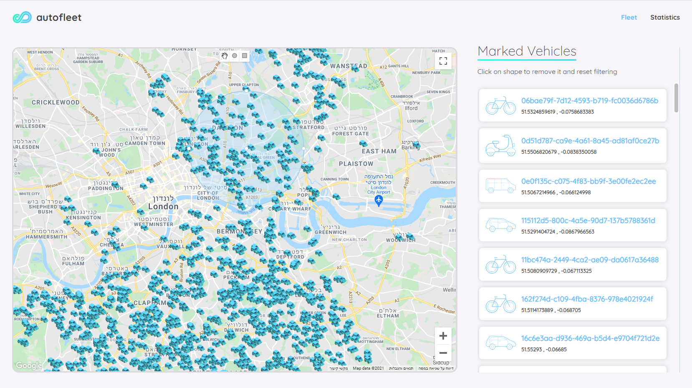
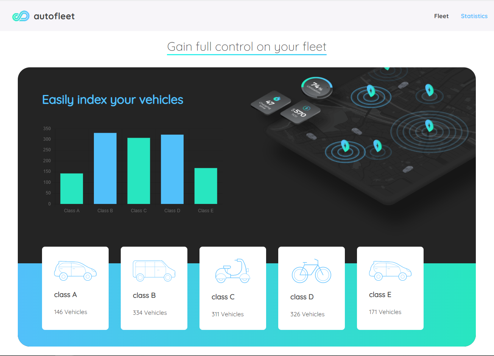
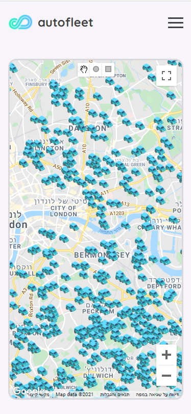
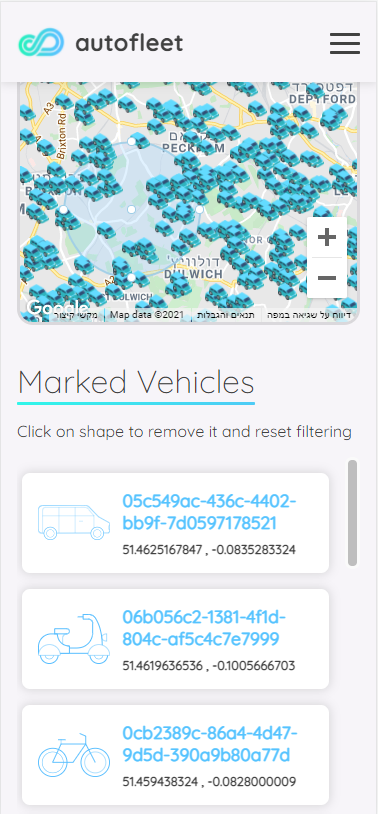

# Code Challenge - Live Vehicle Map

Dear Recruter,

First of all, I want to say thank you for the qiven opportunity, this is the first time I have dealt with this kind of data queries.

This project was built in 5 days.
This SPA was built with React on client-side and React Redux data-management, Node.js server on server-side and mongoDB database.

This appliction aims to serve a fleet manager by enabling him to see his vehicles locations and to choose vehicles within a given
area by drawing polygons.
By right clicking the polygon the filter is cleared so the manager can focus on another regions.
In addition, I added another tab for statistics so the manager can view the variety of vehicles and their status at any given moment.

Hope you enjoy the product and you will be satisfied with the outcome. 

**https://tairbitan-autofleet.herokuapp.com/**

## Screenshots from the app
### Main page

### Statistics page

### Mobile

